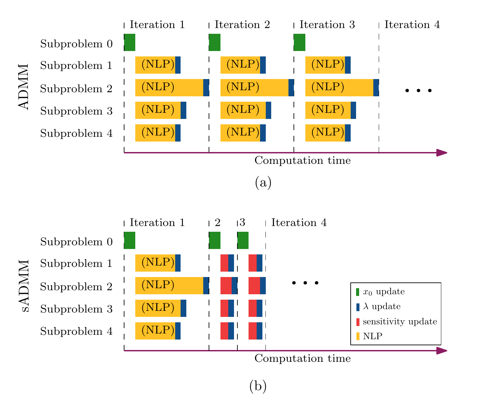

# Sensitivity-assisted Distributed Optimizatin

This repository contains the files for the sensitivity-assisted ADMM. 

In the ADMM framework, the subproblems are solved iteratively by fixing the alternate directions and the dual variables in the each subproblem. Noting that between each iteration, the subproblems solved are similar, the main idea here is to improve the computational speed of the procedure by exploiting the parametric sensitivity of the subproblems. 

